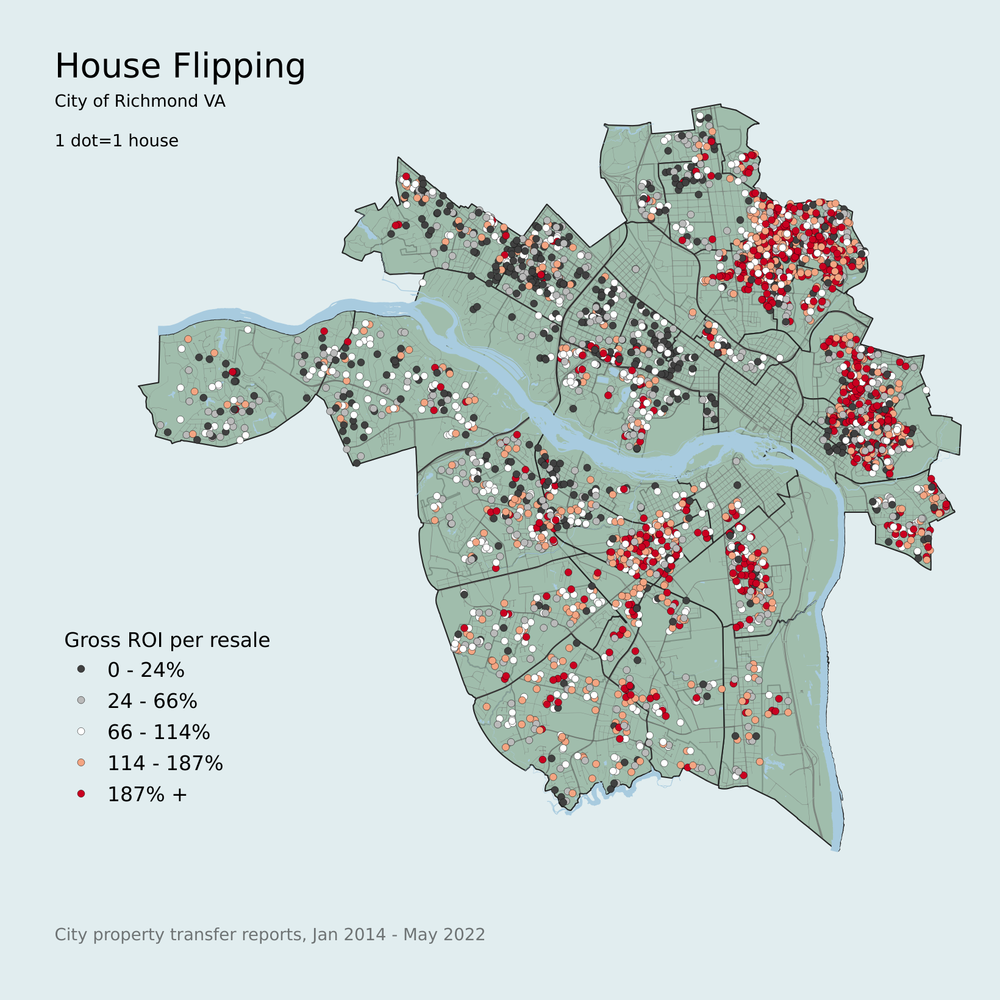
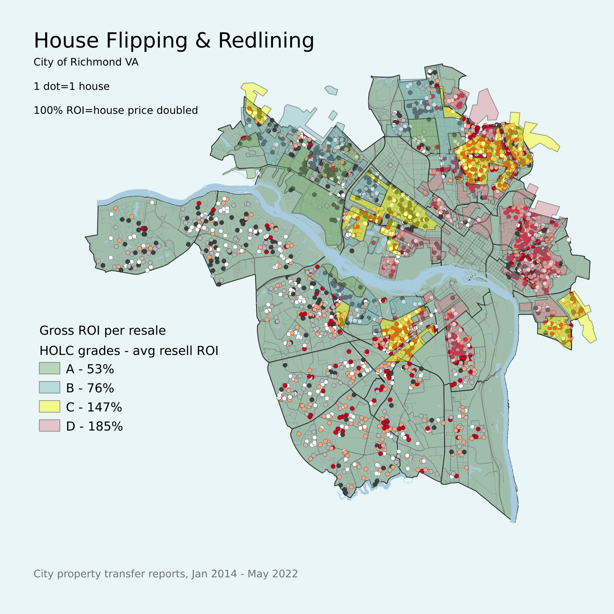

# Richmond VA house flipping

## Data processing

This data is mostly from the City of Richmond Assessor's Office [property transfer reports](https://www.rva.gov/assessor-real-estate/data-request), which go back to 2012. 

* get_all_transfers.ipynb - combines all of the Excel files into one dataframe and saves it
* flip analysis.ipynb - does most of the work
* data/ - this directory is mostly empty in this repo, but locally I store working data files here
* data/flips.csv - the output from data processing

In the `flip analysis` notebook, I applied some data filters and transforms:

* Filter to single-family homes (property classes 101, 110, 115, 120, 130, 150)
* Group by parcel ID + sale to combine extension cards (e.g. see the [extensions tab for this parcel](https://apps.richmondgov.com/applications/PropertySearch/Detail.aspx?pin=W0000523031) )
* To identify flips:
    - self-join on parcel id and grantee=grantor (ie, the buyer resold it)
    - where the property was held for between 0 and 2 years before reselling
    - removed most of the foreclosures / multiple parcel sales / special financing, etc.
    - removed new construction (<2 years old)
* Added some fields - hold_time, price_diff, size_diff, year, age, council, roi

I also made some plots, like this one showing how the gross ROI varies by council district and year. If you're not familiar with the local geography, districts 1, 2, and 4 are statistically wealthier and whiter than the rest of the city. 

Gross ROI % is calculated as the price difference (second sale - first sale) divided by the first sale. 100% means the second sale was twice as much as the first.

## Maps

To make this map, I joined the CSV to the [Parcels](https://richmond-geo-hub-cor.hub.arcgis.com/datasets/parcels-1/explore) shapefile from the city's GeoHub. The parcels are to-scale polygons, which isn't very convenient for heatmaps and also emphasizes the relative size of each parcel, so I converted the layer to geometry centroids, and applied an equal-count 5-class gray-red colormap based on the `flips_roi` column.

Since several people asked about it, I also overlayed the [1923 HOLC "redlining" grades](https://dsl.richmond.edu/panorama/redlining/#loc=12/37.541/-77.562&city=richmond-va&area=D1). As expected from my previous [homeownership and redlining](https://github.com/kfinity/ric-homes) project, the clusters of high gross ROI are mostly in grade D areas with high "negro" populations, and in adjacent grade C areas. The gross ROI is the gross profit relative to the house price, and indicates the cost increase or "markup" that the flipper added to the house.

